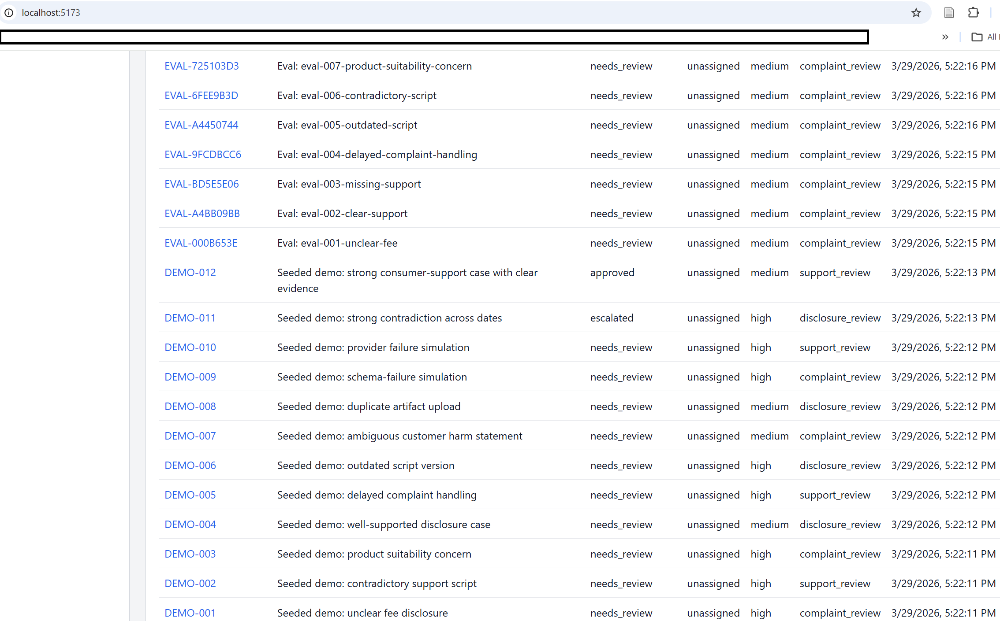
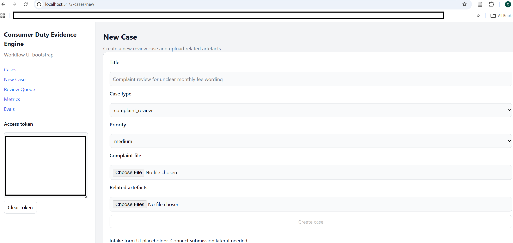
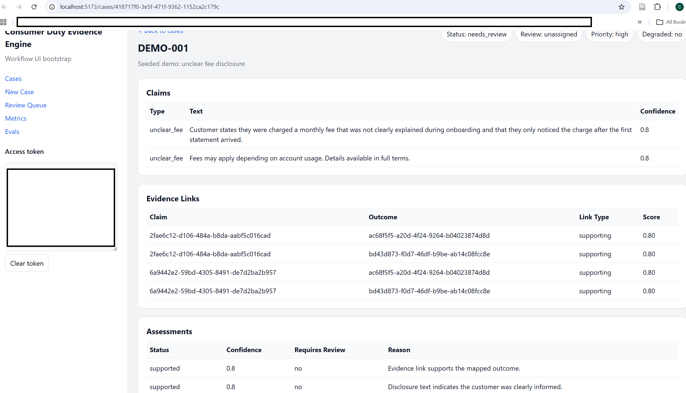
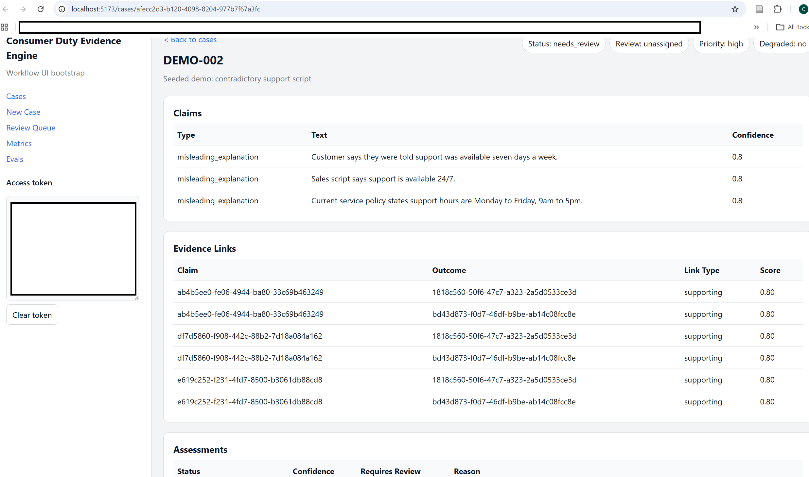
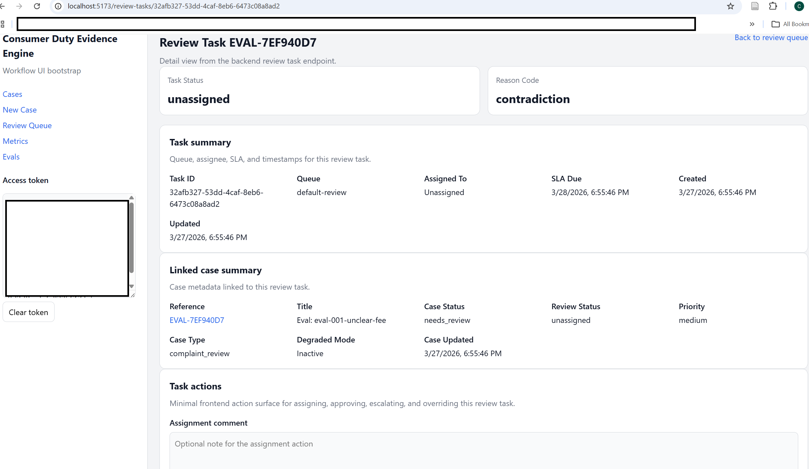
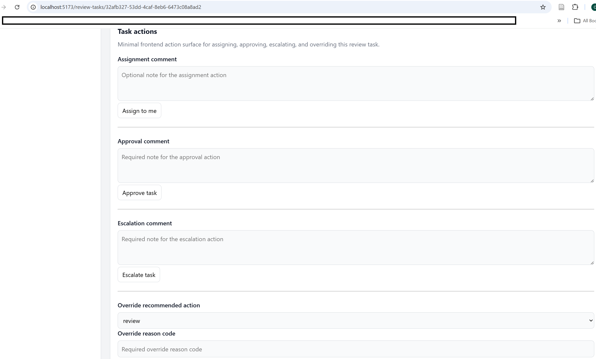
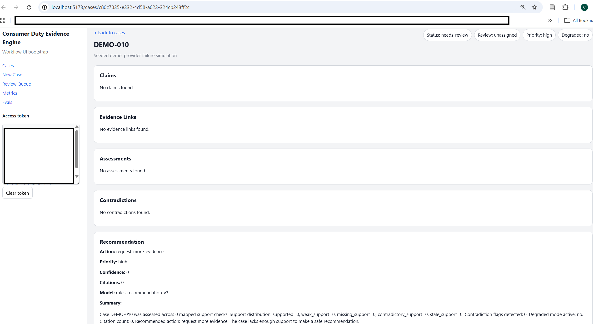
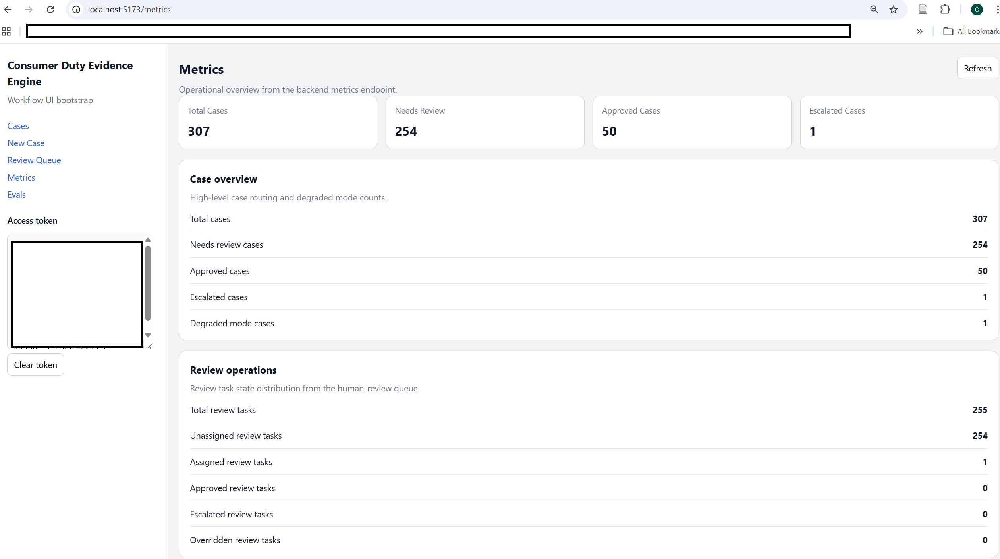
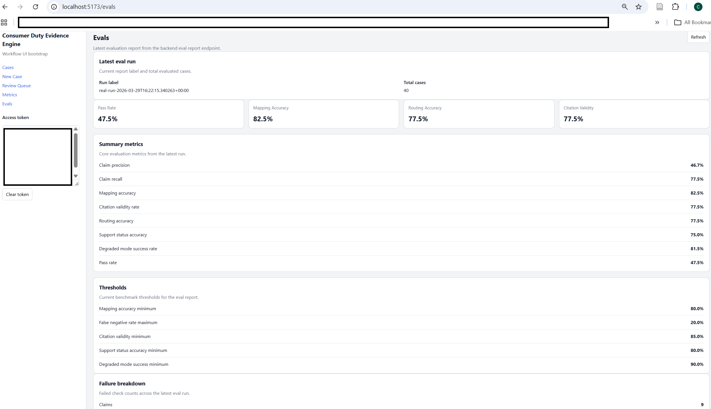
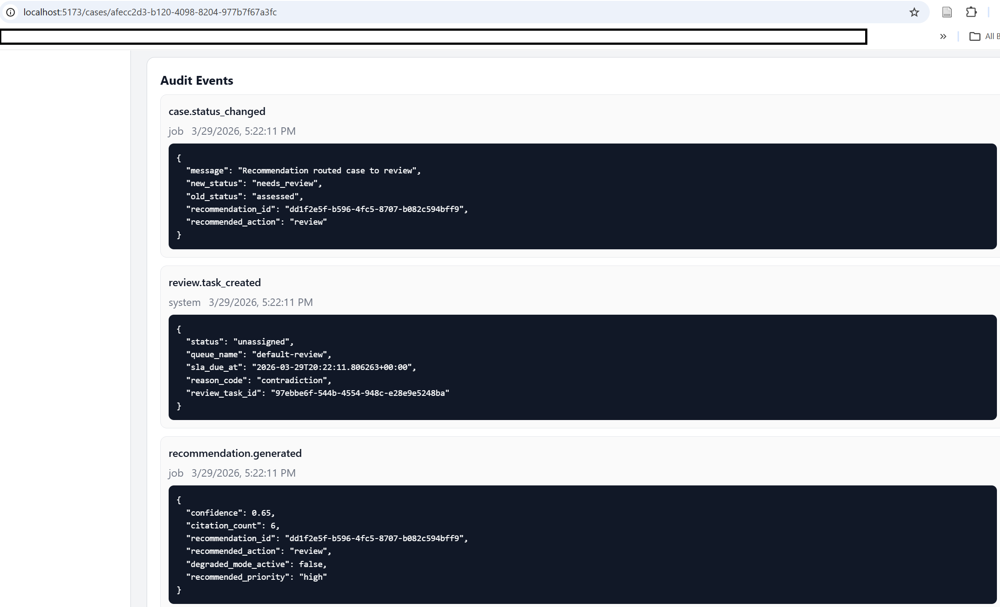

# Consumer Duty Evidence Engine

## AI-assisted evidence review workflow for regulated financial-services artefacts

Consumer Duty Evidence Engine is a Django/React portfolio project that simulates a high-accountability evidence-review workflow inspired by FCA Consumer Duty monitoring expectations.

It ingests complaints, disclosures, support transcripts, scripts, and policy materials; extracts structured claims and outcome-relevant facts; maps them to Consumer Duty outcome areas; scores evidence sufficiency; flags unsupported or contradictory evidence; routes uncertain cases into analyst review; and produces audit-ready outputs with traceable citations, evaluation metrics, and observable workflow state.

---

## Screenshots

  
  
  
  
  
  
  
  
  
  


---

## Why this project exists

Most portfolio AI applications stop at retrieval or summarisation.

This project is designed to demonstrate how AI operates inside a **controlled, auditable workflow** where outputs must be:

- structured  
- traceable  
- reviewable  
- auditable  
- measurable  
- safe under failure  

The focus is not generating answers, but managing **evidence under uncertainty**.

---

## What this project demonstrates

- AI-assisted extraction with strict schema validation  
- rule-assisted outcome mapping to a constrained taxonomy  
- evidence sufficiency scoring:
  - supported  
  - weak support  
  - missing support  
  - contradictory support  
  - stale support  
- contradiction detection across multi-document case bundles  
- human review queues with assignment, approval, escalation, partial override controls, and audit logging  
- structured review-task action surface (assignment, approval, escalation, and override inputs)  
- explicit state machine enforcing workflow correctness  
- observable async pipelines with WebSocket updates  
- regression-tested evaluation harness with 40+ benchmark cases  
- conservative fallback behaviour under provider failure or insufficient evidence  

---

## Architecture summary

**System type:** Django monolith with async workers and React frontend

**Backend**
- Django + Django REST Framework (API and orchestration)
- PostgreSQL (source of truth)
- Redis (cache, broker, Channels layer)
- Celery (async task pipeline)
- Django Channels (WebSockets)

**Frontend**
- React + TypeScript + Vite
- React Query (server state)
- Zod (schema validation)
- Zustand (client state)

**Supporting systems**
- pgvector (limited retrieval support)
- evaluation harness (synthetic datasets + regression runner)
- audit/event system
- observability and metrics layer

---

## Core workflow

1. Upload complaint and related artefacts  
2. Persist artifacts and enqueue ingestion  
3. Parse and segment documents asynchronously  
4. Extract structured claims using strict schema validation  
5. Map claims to Consumer Duty outcome areas  
6. Link supporting and contradicting evidence  
7. Assess evidence sufficiency  
8. Detect contradictions and stale evidence  
9. Generate structured recommendation memo (when safe)  
10. Route uncertain cases into human review  
11. Persist all actions in an audit timeline  

---

## System states

The system enforces a strict state machine:

```text
new → ingestion_pending → parsing → parsed → extraction → mapping → assessment → recommendation
````

Terminal paths:

* `approved`
* `needs_review`
* `escalated`
* `failed`
* `archived`

Invalid transitions are explicitly rejected.

**Review workflow states:**

```text
unassigned → assigned → in_review → approved / overridden / escalated → closed
```

---

## Tech stack

**Backend**

* Django
* Django REST Framework
* PostgreSQL
* Redis
* Celery
* Django Channels
* pgvector
* drf-spectacular (OpenAPI)

**Frontend**

* React
* TypeScript
* Vite
* React Router
* React Query
* Zod
* Zustand

**Tooling**

* Pytest
* Vitest
* Ruff, Black, isort
* Docker Compose
* GitHub Actions CI

---

## Local setup

### Requirements

* Python 3.14
* Node.js 20+
* pnpm
* Docker Desktop

### Backend setup

```powershell
cd D:\AI-Projects\consumer-duty-evidence-engine
.\.venv\Scripts\Activate.ps1
python -m pip install -r backend\requirements\dev.txt
```

### Start infrastructure

```powershell
docker compose up -d db redis
```

### Run backend

```powershell
cd backend
python manage.py migrate
python manage.py runserver
```

### Run worker

```powershell
cd backend
celery -A config worker -l info
```

### Frontend setup

```powershell
cd frontend
pnpm install
pnpm dev
```

Frontend: [http://localhost:5173](http://localhost:5173)
Backend: [http://localhost:8000](http://localhost:8000)

---

## Demo data

The project includes **12 seeded demo cases**, covering:

* unclear fee disclosure
* contradictory support scripts
* missing evidence scenarios
* stale policy/script cases
* schema failure simulation
* provider failure simulation and safe fallback routing
* clearly supported cases

Seed data:

```powershell
python infra/scripts/seed_demo_data.py
```

---

## Evaluation

The system includes a synthetic evaluation harness with **40+ cases** across:

* supported scenarios
* weak support
* contradictions
* missing evidence
* stale evidence
* adversarial formatting
* routing edge cases
* citation validation cases

Eval runner:

```powershell
python infra/scripts/run_eval_suite.py
```

**Metrics tracked:**

* claim precision / recall
* outcome mapping accuracy
* support-status accuracy
* routing accuracy
* citation validity rate
* degraded-mode success rate

Reports:

```text
evals/reports/latest-report.json
```

---

## Observability and failure handling

The system explicitly models uncertainty and failure:

* correlation IDs for request tracing
* structured JSON logging
* audit events for all state transitions
* model execution logs (latency, status, cost)
* WebSocket status updates

Failure handling:

* schema validation failures → forced review
* provider failures → conservative fallback or abstention
* contradictory evidence → review routing
* missing evidence → review routing
* stale evidence → review routing

**Fallback modes**

* rules-only mode when model unavailable
* source-only mode when generation unsafe
* request-more-evidence routing when the case lacks enough support for a safe recommendation

---

## API documentation

OpenAPI schema:

```text
/api/schema/
```

Swagger UI:

```text
/api/docs/
```

Key endpoints:

* `/api/cases/`
* `/api/cases/{id}/claims/`
* `/api/cases/{id}/assessments/`
* `/api/cases/{id}/recommendation/`
* `/api/review-tasks/`
* `/api/metrics/overview/`
* `/api/evals/runs/`

---

## Architecture documentation

See:

```text
docs/architecture/
docs/adr/
docs/domain/
docs/demos/
```

Key documents:

* system overview
* state machine
* ingestion pipeline
* evaluation design
* failure modes
* observability

---

## Limitations

* Portfolio-grade simulation, not production compliance software
* Uses synthetic datasets rather than real regulated data
* Simplified Consumer Duty taxonomy
* Limited retrieval (pgvector used minimally)
* Mock or constrained model integration

---

## Honest claims

* Built an AI-assisted evidence-review workflow with async ingestion, structured extraction, and human review routing
* Implemented evidence sufficiency scoring and contradiction detection across multi-artifact case bundles
* Designed an evaluation harness with regression datasets and measurable metrics
* Added conservative fallback and failure-aware routing for provider failure and low-support cases
* Exposed full audit trail, state transitions, and review actions through API and UI

---

## License

This project is licensed under the MIT License. See the `LICENSE` file for details.